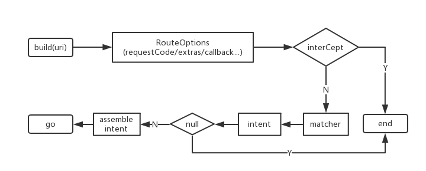

### 项目架构说明：

模块化开发，模块内部原则上采用MVP模式，简单的交互可适用原生的MVC模式

1.关于模块化的几个问题点：

* Q1.子模块如何单独编译
    
     在子模块的build.gradle中定义常量控制

```gradle
      def isDebug =true
      if(isDebug.toBoolen()){
         apply plugin:'com.android.application'
      }else{
	     apply plugin:'com.android.library'
      }
```      

          配置manifeset
     
```gradle
      sourceSets{
          main{
             if(isDebug.toBoolen()){
                manifest.srcFile ‘src/main/debug/AndroidManifest.xml’
             }else{
	            apply plugin:’src/main/AndroidManifest.xml’
             }
          }
      }
```
* Q2.组件版本库一致性

    统一整个project的依赖版本，可以在project的build.gradle做统一处理，也可以新建一个gradle进行引用，项目中采用第二种
   
* Q3.资源的重复定义

    在子模块中gradle中添加 resourcePrefix “xxx_”，强制模块中的资源名称带有xxx_前缀，否则编译不过
       
* Q4.模块之间的页面跳

    router机制
       
* Q5.模块之间的方法调用

    java反射机制，写一个公共方法，传入模块class获取模块方法
       
* Q6.application初始化

    子模块作为application时，有一些初始化的工作需要在Application.onCreate时进行。而作为library时，调不到这个onCreate。所以可以采用Q5的方法。
       
2.关于MVP的说明：

    采用的是contract方式

3.网络请求缓存策略,4种类型

    ONLY_NETWORK只查询网络数据
  
    ONLY_CACHED只查询本地缓存
  
    CACHED_ELSE_NETWORK先查询本地缓存，如果本地没有，再查询网络数据
  
    NETWORK_ELSE_CACHED先查询网络数据，如果没有，再查询本地缓
    
### xxdRouter架构

项目中引入自定义Gradle plugin一般有三种方法:

    1.直接写在 build.gradle中
    2.plugin源码放到rootProjectDir/buildSrc/src/main/groovy目录下
    3.plugin打包成jar, 发布到maven仓库, 然后项目通过Build Script依赖jar的形式引入
 
 
### 关于多渠道打包

接入热修复的多渠道打包有两个问题：

1.tinker使用步骤：

    a.运行 assembleRelease task 构建基准包;
    b.运行 tinkerPatchRelease task 构建补丁包

2.productFlavors方式，由于接入的是友盟，这种方式必然导致不同的渠道包dex的差异，因此需要分渠道打补丁包，当前版本这么多补丁包如何发布？
    
    解决方案：以tinker为例，可以从appVersion上入手考虑，不同的渠道包appVersion=1.0.3_baidu,这样在后台发布不同的渠道包时，先去新建不同的版本,如1.0.3_baidu,1.0.3_yingyongbao，
    也就是与渠道包一一对应的版本，然后不同的渠道补丁包依次放入对应的版本中，即可解决该问题。

3.如何只打一个补丁包，修复当前版本的所有渠道包？

    解决方案：只打一个补丁包，则需要保证不同的渠道包dex是一致，因此不能采用productFlavors方式，需要通过其它的手段来注入渠道，例如可以采用zip comment或者walle。本项目采用的是walle方式，
    walle具体原理以及接入打包方式可以去上Github看详细说明。本项目：
  * 打包工具：walle gradle接入方式（也可采用命令行的方式）
  * 打包命令：上传360或爱加密等进行加固，获取未签名包
    
    1.对齐优化：./zipalign -v 4 app-release.encrypted.apk app-release.encrypted_zipalign.apk
    
    2.apksigner V2签名：./apksigner sign --ks xxd.jks --out app-release.encrypted_signed.apk  app-release.encrypted_zipalign.apk
    
    3.检查是否签名成功：java -jar CheckAndroidV2Signature.jar app-release.encrypted_signed.apk
    
    4.批量写入渠道：java -jar walle-cli-all.jar batch -f channel app-release.encrypted_signed.apk /Users/louis/tool/1.0.7
    
    5.单个写入渠道：java -jar walle-cli-all.jar put -c wandoujia app-release.encrypted_signed.apk
    
### 关于ijkPlayer

1.接入方式

 * gradle方式：
 
   ```
   compile 'tv.danmaku.ijk.media:ijkplayer-java:0.8.4'
   compile 'tv.danmaku.ijk.media:ijkplayer-armv7a:0.8.4'
   compile 'tv.danmaku.ijk.media:ijkplayer-armv5:0.8.4'
   compile 'tv.danmaku.ijk.media:ijkplayer-x86:0.8.4'
   ```
 * JNI编译.so：
 
 ```
     git clone https://github.com/Bilibili/ijkplayer.git ijkplayer-android
     cd ijkplayer-android
     git checkout -B latest k0.8.4
     ./init-android.sh
     cd android/contrib
     ./compile-ffmpeg.sh clean
     ./compile-ffmpeg.sh all
     cd ..
     ./compile-ijk.sh all
```
2.编译支持https
 
    a.下载源码：
      git clone github.com/Bilibili/ijkplayer
    b.进入ijkplayer工程根目录，配置文件：
      cd config
      rm module.sh
      ln -s module-lite.sh module.sh
    c.初始化openssl、ffmpeg
      ./init-android-openssl.sh 
      ./init-android.sh
    d.编译
      cd android/contrib
      ./compile-openssl.sh clean
      ./compile-ffmpeg.sh clean   
      ./compile-openssl.sh all
      ./compile-ffmpeg.sh all
    e.生成so
      cd ..
      ./compile-ijk.sh all
      
    生成的so文件可在 ijkplayer/android/ijkplayer/ 下找到
    
 ### 关于反编译
 
 要想将APK文件中的代码反编译出来，我们需要用到以下两款工具：
 
 * dex2jar：这个工具用于将dex文件转换成jar文件
   
   http://sourceforge.net/projects/dex2jar/files/
 * jd-gui：这个工具用于将jar文件转换成java代码
  
   http://jd.benow.ca/
 * 反编译资源：Android studio自带的apktool